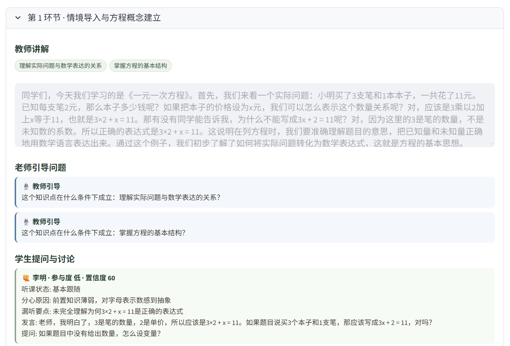
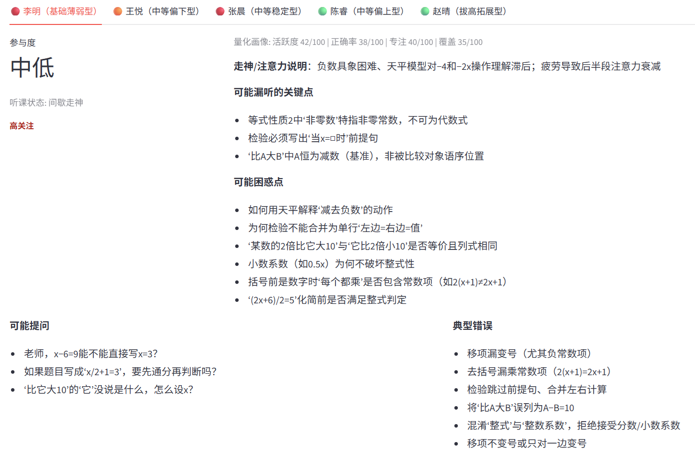
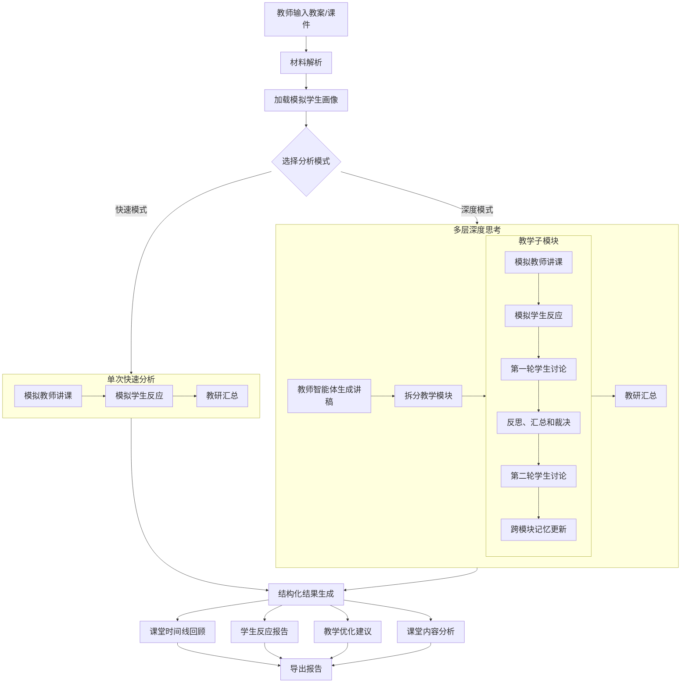

# AI Virtual Student Teaching Lab

Language: English | [中文](README_CN.md)


# 🧠 TeachingAI — AI Virtual Student Lab

> Upload your lesson → simulate real student reactions → improve your teaching design

🔥 An AI-powered lesson rehearsal tool for teachers

---

## ✨ What makes it different?

Most AI tools for education:
❌ Just generate answers  
❌ Ignore student differences  

TeachingAI:
✅ Simulates different student types (top / average / struggling)  
✅ Recreates realistic classroom reactions  
✅ Identifies unclear, confusing, or boring parts of your lesson  

👉 Like running a **virtual classroom rehearsal before the real class**

---

## 🎥 Demo

👉 Live demo: https://teachingai-3ow6w6ubmhea2j5hfywdai.streamlit.app/

👉 Example output:  

> Class simulation record


> Student simulation result


## 🚀 Quick Start

```bash
git clone https://github.com/jianghaoyu123/TeachingAI
cd TeachingAI
pip install -r requirements.txt
python -m streamlit run app.py
```

### 1. Dual Analysis Modes: Quick Mode + Deep Thinking Mode

| Mode | Approach | Best For |
|------|----------|----------|
| **Quick Mode** | Single model call — generates whole-class reactions, difficulty assessment, and optimization suggestions directly from the lesson plan and student profiles | Early-stage lesson planning, time-sensitive use, or API-cost-conscious scenarios |
| **Deep Thinking Mode** | Multi-agent multi-round rehearsal: teacher script → course split into multiple modules → Round 1 student reactions → Round 2 discussion / devil's advocate / arbitration → teaching-research summary | When you need a more realistic sense of classroom discussion and want more robust recommendations |

High-level flow of Deep Thinking Mode:

1. **Teacher Agent**: Reads the lesson plan / verbatim script, generates a full classroom script, and divides it into 3–8 teaching modules (auto-scaled to material length). After each module, the agent group conducts two rounds of discussion.
2. **Round 1 — Student Agents**: Using the student profiles configured for the current subject (customizable count and ability levels; built-in templates are generated from grade, subject, and level), each student gives raw in-class reactions after listening to a module.
3. **Round 2 — Deliberation Agent**: Organizes student peer review and revision, introduces a devil's advocate challenge and a teaching-observer arbitration, and outputs corrected module-level reactions (including consistency notes and confidence scores).
4. **Cross-module Memory & Consistency Constraints**: The system maintains per-student memory of unresolved confusions, repeated errors, and resolved points. The next module is forced to reference this memory to prevent character drift.
5. **Teaching-Research Aggregator Agent**: Consolidates Round 2 results from all modules and generates a final report with the same structure as Quick Mode (key concepts, whole-class student reactions, difficulty, confidence, optimization suggestions, revised lesson plan).

The Deep Mode UI displays a progress bar. After completion you can expand "Deep Rehearsal: Teacher Script & Module-by-Module Interactions" to view details by module and by student. Each student shows module-level confidence and consistency notes; each module shows consensus / disagreement / immediate adjustments / memory updates. Exported reports (Markdown / HTML / Word) also include this process information.

> Note: Deep Mode makes approximately `2 + 2 × number_of_modules` API calls (e.g., ~12 calls for 5 modules). Time and cost are typically significantly higher than Quick Mode.

### 2. UI & Code Structure

- `app.py` serves only as the Streamlit entry point; the main interface lives in `teachingai_app/ui/`.
- Core capabilities remain in `teachingai_app/core/` (material parsing, LLM calls, quick/deep pipelines, report export).

## Features

- Supported input formats: TXT, Markdown, DOCX, PPTX, PDF, and pasted plain text
- OCR fallback: recognizes text in images when PDF/PPT text layers are insufficient
- Subject and grade selection (covers common grade levels across primary, middle, and high school)
- Two analysis modes:
  - **Quick Mode**: Completes student reaction simulation and optimization suggestions in a single call (faster)
  - **Deep Thinking Mode**: Teacher agent generates script and splits into modules → Round 1 student reactions → Round 2 discussion / devil's advocate / arbitration → aggregated report (more realistic, takes longer)
- Deep Mode memory mechanism (new):
  - **Memory reinforcement**: repeated confusions/errors are strengthened across modules
  - **Memory decay/forgetting**: weak memories decay over modules to reduce stale bias
- Student profiles automatically switch by grade, subject, and ability level: humanities profiles emphasize reading comprehension and evidence expression; STEM profiles emphasize step-by-step reasoning and condition verification
- Profile editing panel: customize and save student profiles
- Quantitative profile indicators (editable per student):
  - `activity_level` (learning activity)
  - `baseline_success_rate` (baseline correctness)
  - `focus_stability` (attention stability)
  - `knowledge_coverage` (knowledge coverage)
- Built-in quantitative defaults are level-aware (high > mid-high > mid > mid-low > low) so stronger profiles start with higher activity/accuracy/focus/coverage priors
- Profile template JSON import/export: easy sharing and reuse across teaching-research groups
- Supports multiple model APIs: DeepSeek, Qwen, GLM, OpenAI, Gemini, Claude, Kimi, MiniMax
- Outputs:
  - Key concept extraction
  - Different student reactions and predicted error patterns (generated in one pass in Quick Mode; aggregated from multi-round module discussions in Deep Mode)
  - Lesson difficulty assessment
  - Teaching optimization suggestions
  - Summary of AI-proposed lesson plan revisions
  - Side-by-side view of original vs. revised lesson plan
  - AI-revised lesson plan based on suggestions
  - Deep Mode extras: full classroom script, module-by-module breakdown with each student's in-class speech / confusions / questions / errors
  - Deep Mode additions: module arbitration consensus / disagreements, cross-module memory updates, whole-class result confidence scores (with per-student explanations)
  - Student reaction report and revised lesson plan available as separate downloads (Markdown / HTML / Word)

## Quick Start

Using the live app is recommended: https://teachingai-3ow6w6ubmhea2j5hfywdai.streamlit.app/

To run locally:

1. Install dependencies

```bash
pip install -r requirements.txt
```

2. Launch the app

```bash
python -m streamlit run app.py
```

3. Use the interface in your browser
- Select a Model and enter your API Key
- Upload lesson plan / verbatim script / PPT / PDF (multiple files supported)
- Or paste text directly
- Select subject and grade
- To customize classroom profiles, edit and save them in student card
- In the profile editor, "Required Teaching Support" refers to additional explanation scaffolding, prompting strategies, or practice arrangements the teacher can provide
- "Strengths" indicates what this type of student typically does well; "Weaknesses" indicates where they are most likely to get stuck; "Common Errors" indicates the most frequent mistakes in class and homework
- In the profile editor, each student also has four 0-100 quantitative indicators (`activity_level`, `baseline_success_rate`, `focus_stability`, `knowledge_coverage`) to better constrain simulation differences between levels
- Export the current student profiles as JSON, or import a JSON file to overwrite the current subject template
- "OCR (Image PDF/PPT)" is enabled by default
- Select "Quick Mode" or "Deep Thinking Mode" above the "Start Rehearsal & Optimization" button on the main page
- Click "Start Rehearsal & Optimization"

## Example Case

To quickly experience a complete workflow, use the built-in example:

- Sample input file: `examples/sample_input_linear_equation.txt`
- Sample walkthrough guide: `examples/sample_case_walkthrough.md`

Recommended demo configuration:

- Subject: Math
- Grade: Grade 7
- Topic: Linear Equations in One Variable
- Export format: Word or HTML

This case is designed to help first-time users quickly understand:

- How to upload or paste a lesson plan
- How the system simulates classroom reactions from different students
- How to use the results to optimize teaching design

For your first Deep Mode experience, select "Deep Thinking Mode" above the "Start Rehearsal & Optimization" button and observe how "Round 1 raw reactions" and "Round 2 post-deliberation results" influence the final aggregated report.

## Model API Configuration

The system has built-in OpenAI-compatible interface configurations. Default values:

- **DeepSeek**
  - Base URL: `https://api.deepseek.com`
  - Model: `deepseek-v4-pro`
- **Qwen** (Alibaba Cloud DashScope compatible mode)
  - Base URL: `https://dashscope.aliyuncs.com/compatible-mode/v1`
  - Model: `qwen-plus`
- **GLM** (Zhipu AI)
  - Base URL: `https://open.bigmodel.cn/api/paas/v4`
  - Model: `glm-4-flash`
- **OpenAI**
  - Base URL: `https://api.openai.com/v1`
  - Model: `gpt-4o-mini`
- **Gemini** (Google AI Studio OpenAI-compatible mode)
  - Base URL: `https://generativelanguage.googleapis.com/v1beta/openai`
  - Model: `gemini-2.0-flash`
- **Claude** (Anthropic official API)
  - Base URL: `https://api.anthropic.com/v1`
  - Model: `claude-3-5-sonnet-latest`
- **Kimi** (Moonshot AI)
  - Base URL: `https://api.moonshot.cn/v1`
  - Model: `moonshot-v1-32k`
- **MiniMax**
  - Base URL: `https://api.minimaxi.com/v1`
  - Model: `MiniMax-M2.7`

Notes:

- You can modify the Base URL and Model to adapt to a private gateway or other compatible services.
- Claude uses the official Anthropic Messages API by default; OpenAI, DeepSeek, Qwen, GLM, Gemini, Kimi, and MiniMax use OpenAI-compatible interfaces by default.
- For Kimi's international endpoint, change the Base URL to `https://api.moonshot.ai/v1`; for MiniMax's international endpoint, use `https://api.minimax.io/v1`.
- The system prompt automatically injects "subject + grade + topic" information to make suggestions more relevant to the specific teaching context.
- Custom profiles are saved to the local file `teachingai_app/data/custom_profiles.json` and take priority in model prompts.
- For built-in templates, quantitative defaults are assigned by level. For custom templates, user-edited quantitative values are preserved; missing fields are backfilled by level defaults.
- OCR depends on PaddleOCR and PyMuPDF; if dependencies are missing, the system automatically falls back to plain text extraction.

## Architecture

```
app.py                          # Streamlit entry point
teachingai_app/
  ui/
    streamlit_app.py            # Main interface & "Start Rehearsal" flow
    profiles_sidebar.py         # Sidebar student profile editor
    render.py                   # Result display & downloads
    constants.py                # Grade levels, model options, and other constants
  core/
    ingestion.py                # Material parsing (docx / pptx / pdf / txt, with OCR)
    llm_api.py                  # Multi-provider API calls, JSON parsing, report assembly
    analysis_pipeline.py        # Unified entry point for quick / deep modes
    deep_simulation.py          # Deep mode: teacher / student Round 1 / deliberation & arbitration / memory consistency / aggregation pipeline
    profiles.py                 # Subject student profiles (built-in + custom JSON)
    models.py                   # Data models (including module interactions, SimulationReport)
    reporting.py                # Report export (Markdown / HTML / Word)
  data/
    custom_profiles.json        # User-saved custom profiles (generated at runtime)
```



## Future Extension Directions

- Deep Mode: configurable discussion rounds, intermediate result caching, parallel student agent calls to reduce wait time
- Integrate school-level local question banks and real error data to validate prediction accuracy
- Support more private model gateways or enterprise deployment options such as Azure OpenAI

## Contributor

- Haoyu Jiang
- Xijie Hu
