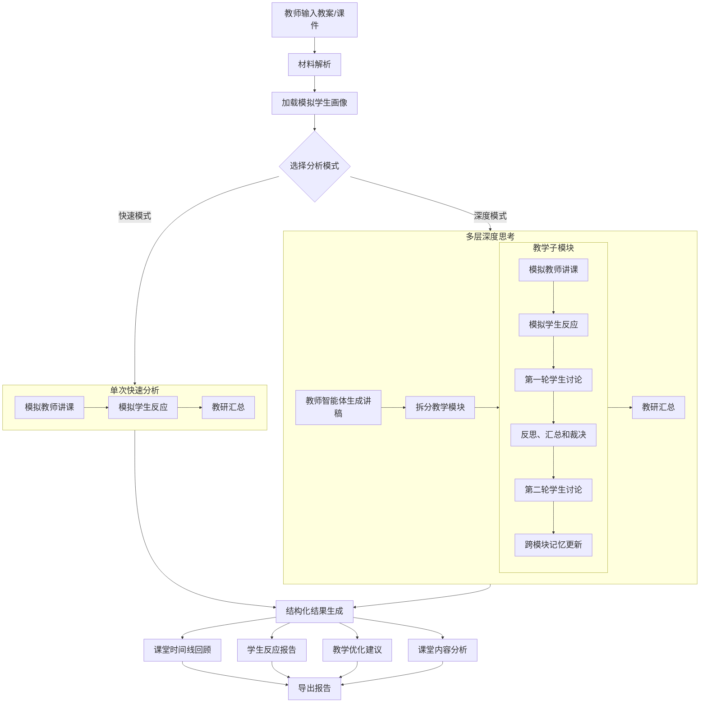

# 🧠 TeachingAI — AI Virtual Student Lab

> 在正式上课之前模拟真正的课堂

🔥 一个用 AI 模拟“真实课堂学生反馈”的备课工具

---

## ✨ 特别之处

大多数AI辅助教学工具:

❌ 直接生成答案  
❌ 不考虑学生差异  

TeachingAI:

✅ 在上课之前了解学生的反应（学生根据学科、年级、能力水平个性化建模）  
✅ 真实课堂互动 + 讨论，深度模式细致模拟  
✅ 自动指出哪里讲不好、哪里太难  

👉 就像你在上课前“预演一节课”


## 💡 为什么重要?
教师通常不知道:
- 学生对教学内容哪一部分可能感到困惑
- 某一部分是否讲解过快
- 重点难点的讲解是否能让学生真正听懂?

TeachingAI**在正式上课之前**解决这些困惑

---

## 🎥 Demo

👉 在线体验：
https://teachingai-3ow6w6ubmhea2j5hfywdai.streamlit.app/

👉 示例输出：
> 课堂模拟记录


> 学生模拟结果


---

## 🚀 快速开始 (30秒跑起来)
强烈推荐运行在线App: https://teachingai-3ow6w6ubmhea2j5hfywdai.streamlit.app/

或者本地运行安装：

```bash
git clone https://github.com/jianghaoyu123/TeachingAI
cd TeachingAI
pip install -r requirements.txt
python -m streamlit run app.py
```

## ⭐ 如果这些帮助了你

如果你曾经:
- 学生听不懂你的讲解
- 课堂效果不符合预期

请考虑为本项目点亮⭐，这将为本项目提供很大的帮助，谢谢！

## 实现细节
### 1. 双模式分析：快速模式 + 深度思考模式

| 模式 | 做法 | 适用场景 |
|------|------|----------|
| **快速模式** | 单次模型调用，直接根据教案与学生画像生成整课反应、难度评估与优化建议 | 备课初期快速摸底、时间紧、API 成本敏感 |
| **深度思考模式** | 多智能体多轮预演：教师讲稿 → 课程划分多个模块 → 第一轮学生反应 → 第二轮讨论/反方挑战/裁决 → 教研汇总 | 需要更真实的课堂讨论感、希望获得更稳健建议时 |

深度思考模式的大致流程：

1. **教师智能体**：读取教案/逐字稿，生成完整课堂讲稿，并拆成 3～8 个教学模块（随材料长度自动调整），在每个教学模块结束后，智能体群体会进行两轮讨论。
2. **第一轮学生智能体**：按当前学科配置的学生画像（可自定义人数与层级，学生画像默认采用根据年纪、学科、能力层级生成的内置模板），在每个模块听完讲解后先给出原始课堂反应。
3. **第二轮讨论裁决智能体**：组织学生互评复议，并引入反方挑战与教学观察员裁决，输出修正后的模块级反应（含一致性说明与置信度分数）。
4. **跨模块记忆与一致性约束**：系统会为每位学生维护“未解决困惑/反复错误/已解决点”记忆，下一模块强制引用，避免角色漂移。
5. **教研汇总智能体**：汇总全部模块的第二轮结果，生成与快速模式相同结构的最终报告（知识点、整课学生反应、难度、置信度、优化建议、修订教案）。

深度模式界面会显示进度条；完成后可展开「深度预演：教师讲稿与分模块互动」，按模块、按学生查看明细。每位学生会显示模块级置信度与一致性说明；每个模块会显示共识/分歧/即时调整/记忆更新。导出报告（Markdown / HTML / Word）也会包含这些过程信息。

> 说明：深度模式 API 调用次数约为 `2 + 2×模块数`（例如 5 个模块约 12 次），耗时与费用通常显著高于快速模式。

### 2. 界面与代码结构整理

- `app.py` 仅作为 Streamlit 入口，主界面为 `teachingai_app/ui/`。
- 核心能力仍位于 `teachingai_app/core/`（材料解析、LLM 调用、快速/深度流水线、报告导出）。

## 功能

- 支持输入：TXT、Markdown、DOCX、PPTX、PDF、手动粘贴文本
- 支持 OCR 回退：当 PDF/PPT 文本层不足时，可识别图片中的文字
- 支持学科与年级选择（覆盖小学、初中、高中常见年级）
- 两种分析模式：
  - **快速模式**：一次调用完成学生反应模拟与优化建议（速度较快）
  - **深度思考模式**：教师智能体生成讲稿并分模块 → 第一轮学生反应 → 第二轮讨论/反方挑战/裁决 → 汇总报告（更真实，耗时更长）
- 深度模式记忆机制（新增）：
  - **记忆强化**：跨模块反复出现的困惑/错误会被强化
  - **记忆衰减/遗忘**：弱记忆会随模块推进逐步衰减，减少陈旧偏差
- 模拟学生的画像按年级、学科、层级水平自动切换：文科偏阅读理解与证据表达，理科偏步骤推理与条件检验
- 学生画像自动生成逻辑改进（新增）：
  - 系统提供按学科、年级、层级匹配的内置学生画像模板
  - 在你输入课题并上传/粘贴材料后，系统会自动补充本节课相关特征到学生画像中
  - 不同层级学生会得到不同的补充特征，便于更贴近真实课堂差异
- 提供画像编辑面板：可按自定义学生画像并保存
- 新增可量化画像指标（每位学生可独立编辑）：
  - 学习活跃度：越高，越可能主动回应、提问、参与
  - 基线正确率：越高，表示这类学生在还没被点拨前也更容易答对
  - 专注稳定性：越高，表示更不容易在长讲解里掉线
  - 知识覆盖度：越高，表示已掌握的前置知识更完整
- 内置模板的量化指标按层级自动分档（high > mid-high > mid > mid-low > low），高层级学生默认先验更高
- 支持画像模板 JSON 导入/导出：便于教研组共享与复用
- 支持多种模型 API：DeepSeek、Qwen、GLM、OpenAI、Gemini、Claude、Kimi、MiniMax
- 输出内容：
  - 关键知识点提取
  - 不同学生反应与可能错误预测（快速模式一次生成；深度模式基于模块内多轮讨论后汇总）
  - 课程难度评估
  - 教学优化建议
  - AI 修改教案的摘要说明
  - 原教案 / 修订后教案对照查看
  - AI 根据建议修订后的新教案
  - 深度模式额外输出：完整课堂讲稿、分模块讲解与各学生课堂发言/困惑/提问/错误
  - 深度模式新增：模块裁决共识/分歧、跨模块记忆更新、整课结果置信度（含分学生说明）
  - 学生反应报告与修订后教案独立下载（Markdown / HTML / Word）

## 运行方式

推荐使用在线App使用，在线App地址：https://teachingai-3ow6w6ubmhea2j5hfywdai.streamlit.app/

如需本地运行，则需要：

1. 安装依赖

```bash
pip install -r requirements.txt
```

2. 启动应用

```bash
streamlit run app.py
```

3. 在浏览器中使用界面
- 选择Model，然后填写API Key
- 上传教案/逐字稿/PPT/PDF（可多文件）
- 或直接粘贴文本
- 选择学科与年级
- 如需定制课堂画像，可在直接点击学生卡片进行修改并保存
- 编辑页面其中“优势”表示这类学生通常做得比较好的地方；“薄弱点”表示最容易卡住的地方；“常见错误”表示课堂和作业中最常出现的错法，“需要的教学支持”指教师可额外提供的讲解支架、提示方式或练习安排
- 编辑页面还支持 4 个 0-100 的量化指标，学习活跃度 (越高，越可能主动回应、提问、参与)，基线正确率(越高，表示这类学生在还没被点拨前也更容易答对)，专注稳定性(越高，表示更不容易在长讲解里掉线)，知识覆盖度（越高，表示已掌握的前置知识更完整），用于更稳定地区分不同层级学生的模拟表现
- 可导出当前学生画像为 JSON，或导入 JSON 覆盖当前学科模板
-“OCR（图片PDF/PPT）”默认启用
- 在主界面「开始预演与优化」上方选择「快速模式」或「深度思考模式」
- 点击“开始预演与优化”

## 示例案例

如果你想快速体验一次完整流程，可以直接使用项目内置案例：

- 示例输入文件：`examples/sample_input_linear_equation.txt`
- 示例讲解说明：`examples/sample_case_walkthrough.md`

推荐演示配置：

- 学科：数学
- 年级：七年级
- 课题：一元一次方程
- 导出格式：Word 或 HTML

这个案例适合让第一次使用软件的老师快速理解：

- 如何上传或粘贴教案
- 系统如何模拟不同学生的课堂反应
- 如何根据结果优化教学设计

首次体验深度模式时，可在主界面「开始预演与优化」上方选择「深度思考模式」，观察“第一轮原始反应”与“第二轮讨论裁决后结果”对最终汇总报告的影响。

## 模型 API 配置（中国环境）

系统内置 OpenAI 兼容接口配置，默认值如下：

- DeepSeek
  - Base URL: `https://api.deepseek.com`
  - Model: `deepseek-v4-pro`
- Qwen（阿里云 DashScope 兼容模式）
  - Base URL: `https://dashscope.aliyuncs.com/compatible-mode/v1`
  - Model: `qwen-plus`
- GLM（智谱）
  - Base URL: `https://open.bigmodel.cn/api/paas/v4`
  - Model: `glm-4-flash`
- OpenAI
  - Base URL: `https://api.openai.com/v1`
  - Model: `gpt-4o-mini`
- Gemini（Google AI Studio OpenAI 兼容模式）
  - Base URL: `https://generativelanguage.googleapis.com/v1beta/openai`
  - Model: `gemini-2.0-flash`
- Claude（Anthropic 官方 API）
  - Base URL: `https://api.anthropic.com/v1`
  - Model: `claude-3-5-sonnet-latest`
- Kimi（月之暗面 Moonshot）
  - Base URL: `https://api.moonshot.cn/v1`
  - Model: `moonshot-v1-32k`
- MiniMax
  - Base URL: `https://api.minimaxi.com/v1`
  - Model: `MiniMax-M2.7`

说明：

- 你可以修改 Base URL 和 Model，以适配私有网关或其他兼容服务。
- 其中 Claude 默认走 Anthropic 官方 Messages API；OpenAI、DeepSeek、Qwen、GLM、Gemini、Kimi、MiniMax 默认走 OpenAI 兼容接口。
- Kimi 海外节点可将 Base URL 改为 `https://api.moonshot.ai/v1`；MiniMax 国际节点可改为 `https://api.minimax.io/v1`。
- 系统提示词会自动注入“学科 + 年级 + 课题”信息，使建议更贴合具体教学场景。
- 自定义画像会保存到本地文件 `teachingai_app/data/custom_profiles.json`，并优先用于模型提示词。
- 内置模板会按层级自动设置量化默认值；自定义模板会保留用户手工编辑值，缺失字段才会按层级补齐。
- OCR 依赖 PaddleOCR 与 PyMuPDF；若环境缺失依赖，系统会自动回退为普通文本提取。

## 架构说明

```
app.py                          # Streamlit 入口
teachingai_app/
  ui/
    streamlit_app.py            # 主界面与「开始预演」流程
    profiles_sidebar.py         # 侧边栏学生画像编辑
    render.py                   # 结果展示与下载
    constants.py                # 年级、模型选项等常量
  core/
    ingestion.py                # 材料解析（docx / pptx / pdf / txt，含 OCR）
    llm_api.py                  # 各厂商 API 调用、JSON 解析、报告组装
    analysis_pipeline.py        # 快速 / 深度模式统一入口
    deep_simulation.py          # 深度模式：教师 / 学生首轮 / 讨论裁决 / 记忆一致性约束 / 汇总流水线
    profiles.py                 # 学科学生画像（内置 + 自定义 JSON）
    models.py                   # 数据模型（含模块互动、SimulationReport）
    reporting.py                # 报告导出（Markdown / HTML / Word）
  data/
    custom_profiles.json        # 用户保存的自定义画像（运行时生成）
```



## 后续可扩展方向

- 深度模式：可配置讨论轮次、中间结果缓存、学生智能体并行调用以缩短等待
- 增加学校本地题库与真实错题数据校验预测效果
- 支持更多私有模型网关或 Azure OpenAI 等企业部署方式

## 贡献者
- Haoyu Jiang
- Xijie Hu
